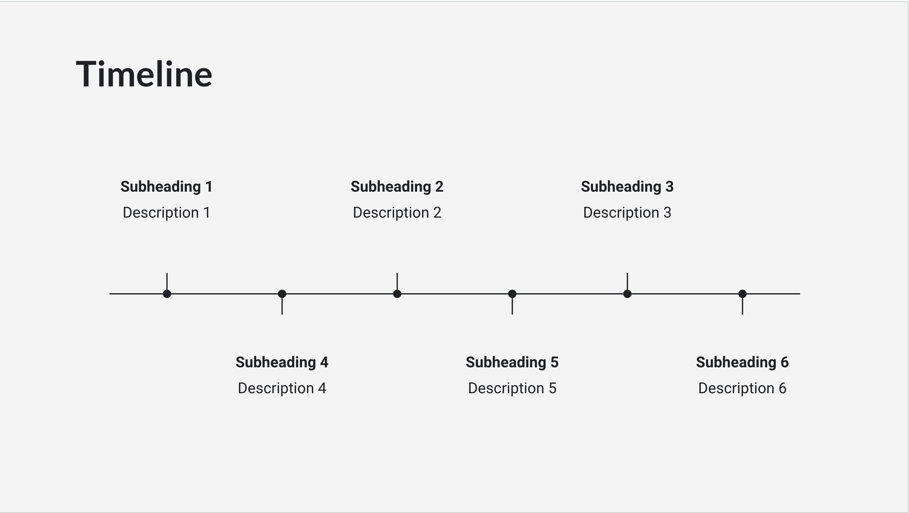

# Alai Coding Challenge: TLDraw Timeline Implementation

Welcome to the Alai Coding Challenge! This project is set up with React, TypeScript, and TLDraw.

## Challenge Overview

Your task is to create a timeline component using TLDraw, similar to the one found on https://getalai.com/. You will also need to implement a user input feature to dynamically generate timeline elements.

## Tasks

1. Create a timeline element using TLDraw similar to what you can see on https://getalai.com/
   

2. Add an input field where the user can enter desired number of items and a generate button. When the user clicks generate,
   then the timeline element should show that many number of elements.

## Getting Started

1. Clone this repository
2. Install dependencies:
   ```
   npm install
   ```
3. Run the development server:
   ```
   npm run dev
   ```
4. Open your browser and navigate to `http://localhost:5173` (or the port shown in your terminal)

## Project Structure

- `src/App.tsx`: Main application component
- `src/TldrawComponent.tsx`: TLDraw canvas implementation (You'll likely need to modify this)

## Evaluation Criteria

- Feature completion: All required features are fully implemented and functional.
- Code quality and organization
- Proper use of React, TypeScript, and TLDraw

## Submission

Please create a private repo for your submission to avoid leaking the solution. Add our emails (krishna@getalai.com and anmol@getalai.com) when you're ready for review.
Include a brief description of your approach and any challenges you faced.

## Resources

- [TLDraw Documentation](https://tldraw.dev/)
- [React Documentation](https://reactjs.org/)
- [TypeScript Documentation](https://www.typescriptlang.org/docs/)

Good luck, and we look forward to seeing your implementation!
